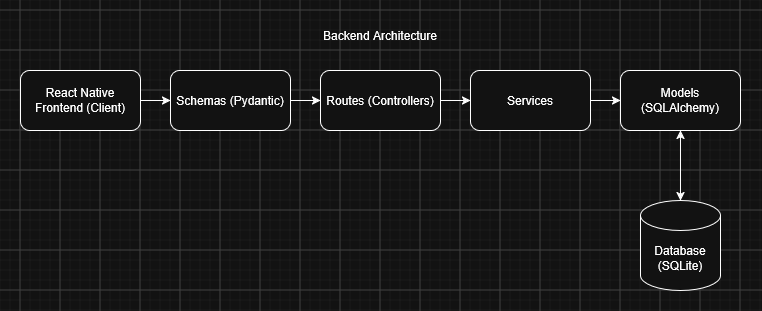

# Calendar-Based Task Tracker
This app is a cross-platform AI-powered task and schedule manager that helps users organize activities, manage folders, and generate optimized schedules using smart automation. It features secure user authentication, interactive calendar views, push notifications, and a modern mobile interface, allowing users to efficiently plan, track, and receive reminders for their daily tasks—all backed by a robust Python FastAPI backend and a React Native frontend.

## Overview
Core Features:
+ Activity Management
  + Create, read, update, and delete activities (tasks).
  + Activities can be organized into folders (categories).
  + Activities have properties like title, description, start/end time, priority, and completion status.
+ Folder Management
  + Create, rename, and delete folders to organize activities.
  + Enforces unique folder names per user.
+ Smart Scheduling (AI-powered)
  + Automatically generate optimized schedules based on user activities and constraints.
  + AI assistant can interpret natural language commands to add or modify tasks.
  + Schedule generation considers time windows, priorities, and durations.
+ Calendar Views
  + Interactive calendar with daily, weekly, and monthly views.
  + Visualize tasks and schedules in a grid/calendar format.
  + Navigate between dates and months.
+ Notifications
  + Push notifications for reminders and scheduled activities (using Expo Notifications).
+ Search and Filtering
  + Search for activities and tasks.
  + Filter and sort tasks by folder, priority, or completion.
+ Preferences and Settings
  + User preferences for themes, notification settings, and calendar display options.

## How to Run
enter the following command in the terminal from the project's root folder: `.\run.ps1`

## Design
Backend (Python/FastAPI):
  + Layered Architecture (MVC-inspired):
    + Routes (Controllers): Handle HTTP requests, map endpoints to business logic, and enforce authentication/authorization.
    + Services (Business Logic): Encapsulate core logic, such as AI scheduling and assistant features, keeping routes thin.
    + Models (Data Layer): SQLAlchemy models represent database tables.
    + Schemas (DTOs): Pydantic schemas validate and serialize/deserialize request and response data.
    + Utils: Shared helper functions (e.g., security, validation).
    + Database: Centralized connection and session management.
    + Dependency Injection: FastAPI’s Depends is used for injecting dependencies like database sessions and user authentication.

Frontend (React Native/Expo):
  + MVVM (Model-View-ViewModel):
    + View (Screens/Components): UI components and screens render the interface and handle user interaction.
    + ViewModel (Stores/Hooks): Zustand stores manage state and business logic, exposing actions and state to views.
    + Model (API Services): API client modules handle HTTP requests and data transformation.

Integration:
  + The frontend communicates with the backend via RESTful APIs.
  + Data validation and transformation are handled on both ends (Pydantic on backend, TypeScript interfaces on frontend).

## Tech Stack
Frontend:
+ Framework: React Native (with Expo)
+ State Management: Zustand
+ Styling: CSS3
+ HTTP Requests: axios and fetch API
+ Navigation: React Navigation
+ Additional Libraries: Expo modules (e.g., notifications, vector icons), TypeScript, ESLint

Backend:
+ Language: Python
+ Framework: FastAPI
+ Database: SQLite
+ ORM: SQLAlchemy
+ Data Validation: Pydantic
+ Authentication: python-jose, passlib, argon2-cffi
+ Server: Uvicorn

Testing:
+ Backend: pytest, httpx

## Backend Architecture

    

